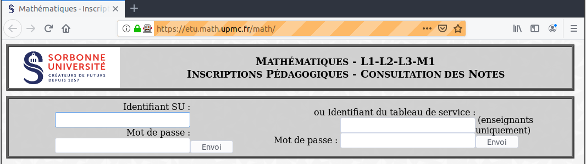

# Insertion automatique des notes sur IP depuis un fichier CSV



## Description
Script Python 3 permettant de rentrer automatiquement les notes sur IP (https://etu.math.upmc.fr/math/) à partir d'un fichier CSV.

## Dépendances
* [Python](https://www.python.org) >= 3.5 (avec les librairies [csv](https://docs.python.org/3/library/csv.html) et [code](https://docs.python.org/3/library/code.html))
* [Selenium](https://pypi.org/project/selenium/) (sur la plupart des distributions linux, Selenium s'installe avec le paquet `python3-selenium`, sinon exécuter `pip3 install selenium`)
* [Mozilla Firefox](https://www.mozilla.org/firefox/)
* [Geckodriver](https://github.com/mozilla/geckodriver/) (télécharger l'exécutable [ici](https://github.com/mozilla/geckodriver/releases) et l'ajouter au `$PATH`)

Testé sous:
* ubuntu 16.04 avec Firefox 60.0.1, Selenium 3.8.0 et Geckodriver 0.19.1
* ubuntu 18.04 avec Firefox 67.0.1, Selenium 3.8.0 et Geckodriver 0.23.0
* ubuntu 20.04 avec Firefox 110.0, Selenium 4.0.0 et Geckodriver 0.32.2
* ubuntu 22.04 avec Firefox 113.0, Selenium 4.9.1 et Geckodriver 0.33.0

## Format de fichier CSV
Le fichier CSV doit contenir une colonne avec le numéro de l'étudiant (avec label id par exemple) et une autre avec la note (avec label note par exemple), d'autres colonnes sont permises. Exemple de fichier 'notes.csv' :
```
id,note,other
3409999,5,ert
3419999,5.6,rtt
3709999,5.8,rtz
3739999,Abs,rtz
3439999,AbsJ,ert
```

## Utilisation
1. Télécharger le [script](script-ip.py) et le lancer avec `./script-ip.py`
2. Une fois que firefox a terminé de charger, procéder au login.
3. Naviguer jusqu'à la page du cours, cliquer sur "saisir les notes" et enfin sur la colonne correspondant aux notes à rentrer.
4. Taper la commande `upload('notes.csv', 'id', 'note')` pour remplir automatiquement les notes sur la page firefox depuis les colonnes 'id' et 'note' du fichier 'notes.csv'.
5. Contrôler que les notes sont rentrées correctement sur firefox et cliquer sur le bouton "Envoyer".
6. C'est terminé, taper `quit()` sur la ligne de commande pour quitter ou recommencer au point 3. pour remplir les notes d'un autre examen.

## Spécifications
Le script remplit les notes de tout les étudiants affichés sur la page IP qui sont également présents dans le fichier CSV (*i.e.* l'intersection des deux). Les notes présentes dans le fichier CSV et sur la page IP sont écrasées, les autres notes sont conservées. Les étudiants présents dans le fichier CSV mais pas sur IP sont signalés et inversément.

## Versions
* v1 (11 janvier 2018) : version initiale
* v2 (4 juin 2018) : utilisation de code.interact à la place de argparse
* v3 (19 novembre 2018) : affichage de la liste des étudiants sur IP pas présent dans le CSV et inversément
* v4 (13 mai 2019) : correction d'un bug lorsque les notes ne peuvent pas être remplies sur IP
* v5 (22 mai 2023) : remplacement de find_element_by_id (dépreciée) par find_element

## Licence
Apache License Version 2.0

## Auteur

    Julien Guillod
    julien.guillod CHEZ sorbonne-universite.fr
    https://guillod.org/
    UFR de Mathématiques
    Sorbonne Université
    France
